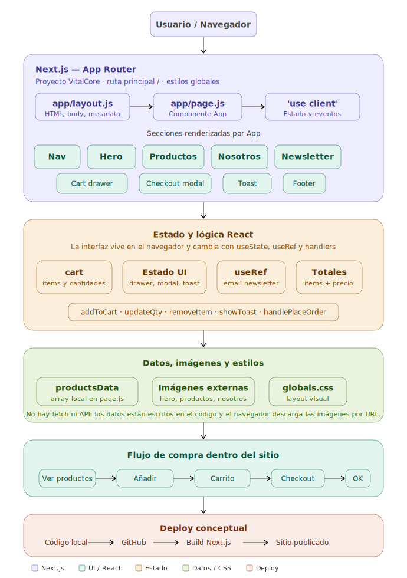
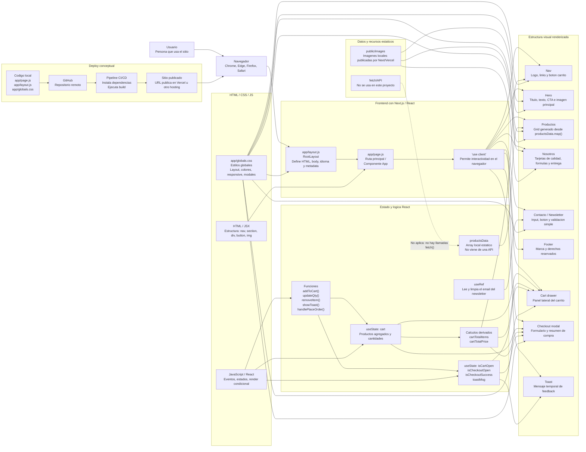

# Diagrama del Frontend - VitalCore





## Que muestra el diagrama

El diagrama muestra como funciona el frontend de VitalCore desde que una persona entra al sitio hasta que interactua con el carrito, el checkout y el newsletter. Tambien muestra como se separan la estructura, los estilos y la logica, como se usan los recursos estaticos en `public/images`, y como seria el deploy de forma conceptual.

## 1. Usuario y navegador

El flujo empieza con el usuario. El usuario no habla directamente con React ni con Next.js: usa un navegador, por ejemplo Chrome, Edge, Firefox o Safari.

El navegador es el programa que pide la pagina, recibe HTML, CSS y JavaScript, y finalmente muestra el sitio en pantalla. Tambien es el que ejecuta la parte interactiva: botones, clicks, apertura del carrito, modal de checkout y mensajes.

## 2. Next.js y organizacion por rutas

El proyecto usa Next.js con App Router. En este proyecto no hay una carpeta `src/app/`; la carpeta real es `app/`.

`app/layout.js` es el layout raiz. Es como el marco general de la aplicacion. Define el documento HTML base, el idioma `es`, el `body`, importa `globals.css` y agrega metadata como titulo y descripcion.

`app/page.js` representa la ruta principal `/`. Es decir: cuando el usuario entra a la pagina inicial del sitio, Next.js renderiza este archivo.

Arriba de `page.js` aparece `'use client'`. Eso significa que este componente necesita ejecutarse en el navegador porque usa interactividad de React, como `useState`, `useRef` y eventos `onClick`.

## 3. Componentes principales

En tu codigo los componentes no estan separados en archivos como `Nav.jsx` o `ProductCard.jsx`. Todo esta dentro de `app/page.js`. Aun asi, conceptualmente se pueden reconocer varias partes:

`Nav` es la navegacion superior. Muestra el logo, los links internos y el boton del carrito. Tambien muestra la cantidad de productos agregados usando `cartTotalItems`.

`Hero` es la primera seccion visual. Tiene el titulo grande, texto descriptivo, boton para ir a productos y una imagen principal.

`Productos` muestra el catalogo. Los productos salen de `productsData`, que es un array escrito directamente en `page.js`. React recorre ese array con `.map()` y crea una tarjeta para cada producto.

`Nosotros` muestra tres tarjetas informativas: calidad certificada, formulas validadas y entrega rapida.

`Contacto / Newsletter` contiene un input de email y un boton. Usa una referencia con `useRef` para leer el valor del input y luego limpiarlo.

`Cart drawer` es el panel lateral del carrito. Se abre o se cierra segun el estado `isCartOpen`.

`Checkout modal` es la ventana de finalizar compra. Se muestra segun el estado `isCheckoutOpen` y cambia a pantalla de exito con `isCheckoutSuccess`.

`Toast` es el mensaje temporal que aparece cuando se agrega un producto o cuando se intenta suscribir al newsletter.

Si el proyecto estuviera separado en componentes reales, en vez de tener todo dentro de `app/page.js`, podria verse asi:

```text
app/
  layout.js
  page.js
components/
  Nav.jsx
  Hero.jsx
  ProductsGrid.jsx
  ProductCard.jsx
  FeaturesSection.jsx
  CartDrawer.jsx
  CheckoutModal.jsx
  Toast.jsx
data/
  products.js
```

En ese caso, `app/page.js` funcionaria como una pagina contenedora: importaria esos componentes y les pasaria datos o funciones por props. Por ejemplo, `ProductsGrid` recibiria `productsData` y `addToCart`; `CartDrawer` recibiria `cart`, `updateQty` y `removeItem`; `CheckoutModal` recibiria `cartTotalPrice` y `handlePlaceOrder`.

## 4. Manejo de estado

El estado es la memoria temporal de la interfaz. En tu proyecto se maneja con `useState`.

`cart` guarda los productos agregados al carrito. Cada item puede tener informacion como nombre, precio, imagen y cantidad.

`isCartOpen` guarda si el panel lateral del carrito esta abierto o cerrado.

`isCheckoutOpen` guarda si el modal de checkout esta abierto o cerrado.

`toastMsg` guarda el texto del mensaje temporal que se muestra al usuario.

`isCheckoutSuccess` guarda si la compra ya fue confirmada para mostrar la pantalla de exito.

Ademas, se calculan dos valores derivados:

`cartTotalItems` suma todas las cantidades del carrito. Sirve para mostrar el numero al lado del boton Carrito.

`cartTotalPrice` suma el precio total segun precio por cantidad. Sirve para mostrar el total en el carrito y en el checkout.

En el diagrama, `UI state` significa "estado de interfaz". No guarda productos, sino si ciertas partes visuales estan abiertas, cerradas o activas. En tu codigo corresponde a `isCartOpen`, `isCheckoutOpen`, `isCheckoutSuccess` y `toastMsg`.

`useRef` es una herramienta de React para guardar una referencia a un elemento del DOM sin convertirlo en estado. En tu caso se usa en `newsletterInputRef`, conectado al input del newsletter. Cuando el usuario toca "Suscribir", el codigo lee `newsletterInputRef.current?.value` para saber que email escribio, muestra un mensaje y despues limpia el input.

`totales` no es un estado nuevo. Representa calculos derivados del carrito:

`cartTotalItems` calcula cuantos productos hay en total.

`cartTotalPrice` calcula el precio total del carrito.

Se llaman derivados porque no se guardan con `useState`; se recalculan a partir de `cart`.

## 5. Logica de interaccion

La logica esta en funciones dentro de `page.js`.

`addToCart(product)` agrega un producto al carrito. Si el producto ya existe, aumenta su cantidad. Si no existe, lo agrega como nuevo item con cantidad 1.

`updateQty(id, delta)` cambia la cantidad de un producto. Si la cantidad queda en cero o menos, el producto se elimina del carrito.

`removeItem(id)` elimina directamente un producto del carrito.

`showToast(msg)` muestra un mensaje durante unos segundos. Se usa para avisar, por ejemplo, que un producto fue agregado.

`handlePlaceOrder()` simula confirmar la compra. Marca el checkout como exitoso y vacia el carrito.

Todas esas funciones existen en `app/page.js`. En el diagrama aparecen agrupadas como "handlers" porque son funciones que responden a acciones del usuario, como hacer click en "Añadir al Carrito", cambiar cantidades, eliminar productos o confirmar el pedido.

## 6. Uso de fetch y recursos

En este proyecto no se usa `fetch()`.

Eso significa que los productos no vienen de una API, base de datos o servidor externo. Estan escritos directamente en el archivo `app/page.js`, dentro de `productsData`.

Las imagenes tampoco dependen ahora de servidores externos. Estan guardadas dentro de `public/images`, por ejemplo `/images/product-creatina.jpg`, `/images/hero-bodybuilder.jpg` y `/images/feature-calidad.jpg`.

Eso es importante para Vercel: Next.js publica automaticamente todo lo que esta dentro de `public/`, entonces el navegador pide esas imagenes al mismo sitio publicado y no a dominios de terceros.

## 7. Separacion entre HTML, CSS y JavaScript/React

La estructura esta en `app/page.js`, escrita como JSX. JSX significa JavaScript XML. Es la sintaxis que usa React para escribir estructura visual parecida a HTML dentro de JavaScript. Por ejemplo, cuando ves `<section>`, `<button>` o `` dentro de `page.js`, eso es JSX.

Los estilos estan en `app/globals.css`. Ese archivo define colores, grillas, tamaños, posiciones, responsive, modal, drawer, tarjetas, botones, imagenes y animaciones.

La logica tambien esta en `app/page.js`. Esa logica incluye estados, funciones, eventos de click, render condicional y calculos del carrito.

En palabras simples: JSX arma la forma, CSS le da apariencia, y React/JavaScript le da comportamiento.

UI significa User Interface, o interfaz de usuario. En este proyecto, la UI es todo lo que la persona ve y toca: la barra de navegacion, el hero, las tarjetas de producto, los botones, el carrito lateral, el checkout, el formulario de newsletter y los mensajes toast.

## 8. Deploy conceptual

El deploy no aparece escrito dentro del codigo, pero se puede representar conceptualmente.

Primero esta el codigo local: `app/page.js`, `app/layout.js`, `app/globals.css` y el resto del proyecto.

Luego ese codigo se sube a GitHub mediante un commit y un push.

Despues una plataforma de deploy, como Vercel, detecta el cambio en GitHub. Ese cambio dispara un pipeline.

El pipeline instala dependencias, ejecuta el build de Next.js y prepara la version final del sitio.

Finalmente, la plataforma publica el sitio en una URL publica. Cuando el usuario entra a esa URL, el navegador recibe la pagina y puede usar la aplicacion.

## 9. Por que el diagrama anterior estaba incompleto o incorrecto

El diagrama anterior mencionaba componentes como `Nav.jsx`, `ProductCard.jsx`, `CartDrawer.jsx` y `CheckoutModal.jsx`. Esos nombres sirven como idea conceptual, pero en tu proyecto real no existen como archivos separados.

Tambien mencionaba `useEffect()` y sincronizacion con `localStorage`. En el codigo actual no hay `useEffect` ni `localStorage`.

Ademas decia `src/app/`, pero tu proyecto usa directamente la carpeta `app/`.

Por ultimo, mencionaba SSR/SSG de manera general. Next.js puede hacer renderizado del lado del servidor o generar paginas estaticas, pero esta pagina tiene `'use client'`, asi que la parte interactiva principal se ejecuta en el navegador.

## 10. Resumen simple

El usuario entra al sitio desde el navegador.

Next.js usa `layout.js` como marco general y `page.js` como pagina principal.

`page.js` construye toda la interfaz: nav, hero, productos, nosotros, contacto, carrito, checkout y toast.

React maneja la memoria temporal con `useState`: carrito abierto, productos agregados, checkout abierto y mensajes.

Los productos no vienen de una API: estan en un array local llamado `productsData`.

Las imagenes del sitio se sirven desde `public/images`, por eso Vercel las publica junto con el proyecto.

`globals.css` se encarga de la apariencia visual.

Para publicar el sitio, el codigo se sube a GitHub y una plataforma como Vercel lo construye y lo publica en una URL.
